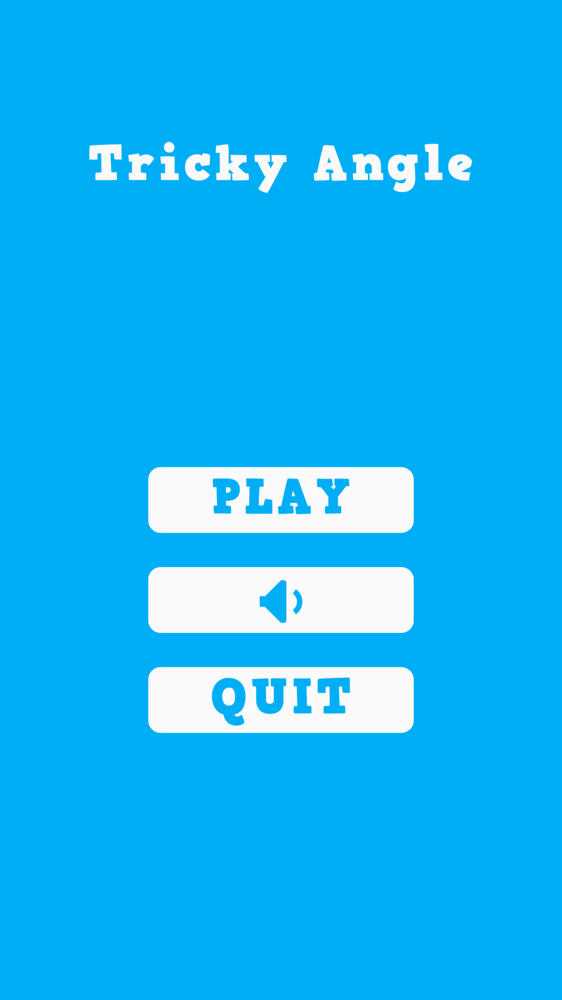
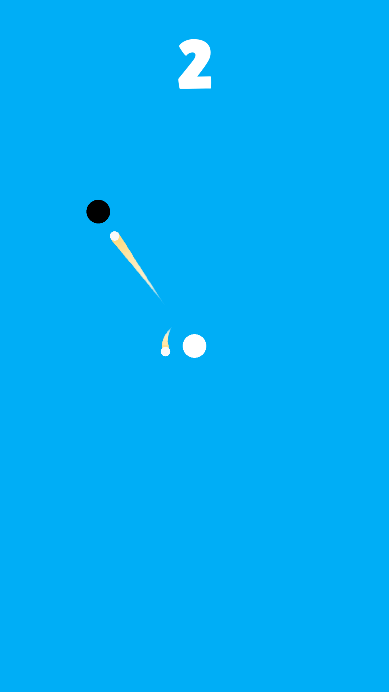

# Tricky Angle
Tricky Angle is a hyper-casual game where you control a rotating projectile, timing your shots to hit approaching enemies! Tap to fire at just the right moment and survive as long as you can! 🎯🔥

Think you’ve got the precision for it? Jump in and test your skills! 🚀🎮

## Screenshots

  
  
  

## Download
- [:sparkles: Download from Itch.io](https://hieubigby.itch.io/tricky-angle)

## Credits
- [Original Project](https://github.com/zerefgd/AngleLaunch)
- Game Engine: [Unity](https://unity3d.com/)
- Thanks to all of the game development community for their awesome help.
